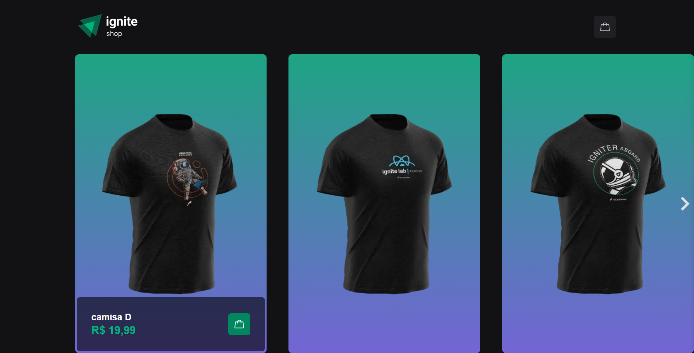
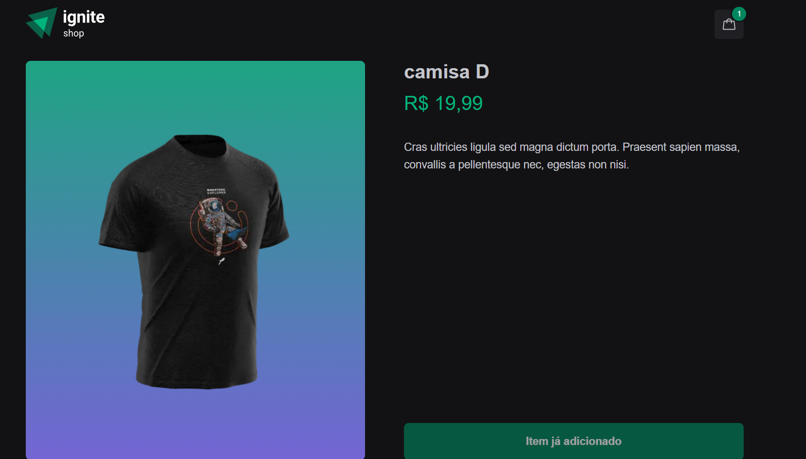
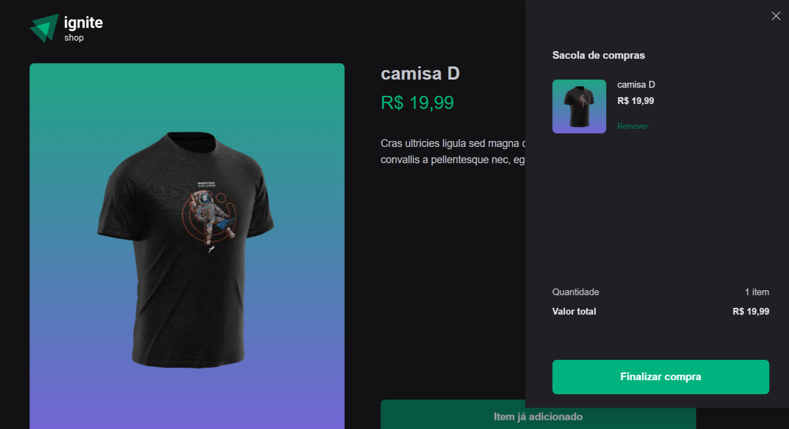
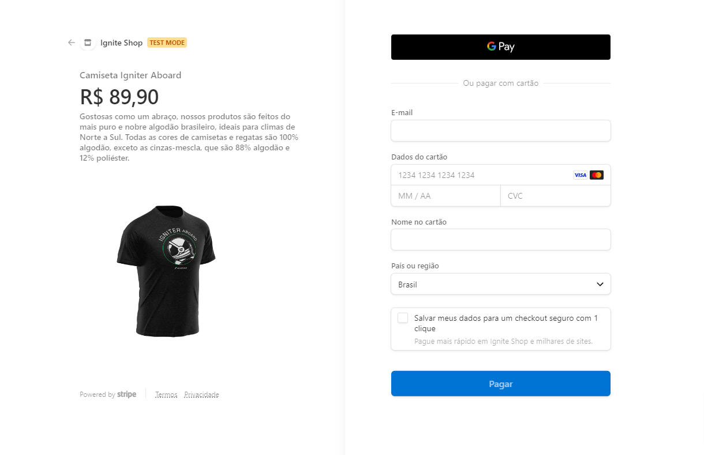

# /rocketseat_2022_ignite_shop

Projeto realizado pela rocketseat, onde foi realizado o desenvolvimento de um backend com strapi, e feito o front com reactjs 

Apos realizado o front foi solicitado uma nova features, de implementar um carrinho de compras
## Foto

| 
| :---: | :---: |

| 
| :---: | :---: |

# Tecnologia

Este projeto foi feito utilizando as seguintes tecnologias:

- [Stripe](https://stripe.com/br)
- [keen-slider](https://keen-slider.io/)
- [use-shopping-cart](https://github.com/dayhaysoos/use-shopping-cart)
- [NextJS](https://nextjs.org/)
- [phosphor-react](https://phosphoricons)
